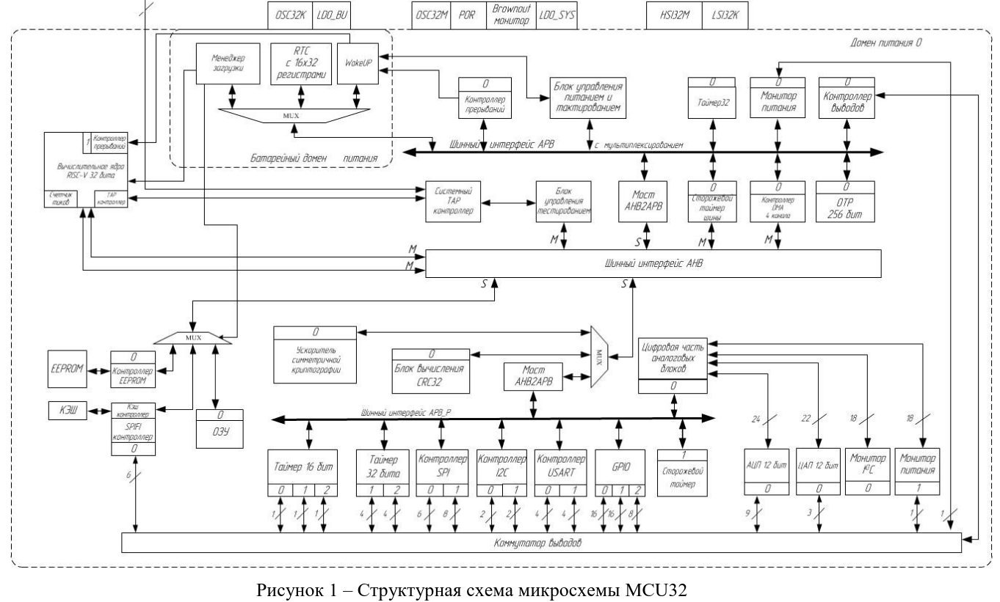

## Blink - классика для MIK32 AMUR пр-ва зеленоградского АО "Микрон"

- Мигает светодиодом LED1.
- Проверяет нажатие пользовательской кнопки и зажигает светодиод LED2.
- Выводит в порт UART0 приветственное сообщение с увеличивающимся значением счетчика.

Прошивка осуществляется командой ```make upload```. 


### Сборка


1. Установить кросс-компилятор GCC для платформы RISC-V. 

Для ОС Linux:

```apt-get install riscv64-none-elf-gcc```

Если в репозитории нет версии GCC для "голого железа" (Baremetal), то можно скачать пре-собранный пакет от xPack: https://github.com/xpack-dev-tools/riscv-none-elf-gcc-xpack/releases/download/v14.2.0-2/xpack-riscv-none-elf-gcc-14.2.0-2-linux-x64.tar.gz

Скачать и распаковать в каталог ```/opt``` следующими командами:
```
wget https://github.com/xpack-dev-tools/riscv-none-elf-gcc-xpack/releases/download/v14.2.0-2/xpack-riscv-none-elf-gcc-14.2.0-2-linux-x64.tar.gz
tar -zxpf xpack-riscv-none-elf-gcc-14.2.0-2-linux-x64.tar.gz -C /opt/
```

После чего путь к компилятору в переменной CROSS: ```/opt/xpack-riscv-none-elf-gcc-14.2.0-2/bin/riscv-none-elf-```


Для ОС FreeBSD:

```
pkg install riscv64-none-elf-binutils
pkg install riscv64-none-elf-gcc
``` 

2. Установить OpenOCD

Для FreeBSD данная утилита устанавливается из стандартного репозитория:

```
sudo pkg install openocd
```

Утилита OpenOCD из стандартного репозитория ALT Linux не поддерживает RISC-V, поэтому устанаваливать надо из исходных кодов, ниже процедура из пяти шагов:

2.1. Установить зависимости:

```
sudo apt-get install autoconf automake texinfo libtool jimtcl-devel libftdi1 libftdi1-devel
```

2.2. Скачать репозиторий OpenOCD с Github-а:

```
git clone https://github.com/riscv-collab/riscv-openocd
```

2.3. Запустить сборку:

```
cd riscv-openocd
./bootstrap
./configure
make
```

2.4. Установить собранный пакет в систему:

```
sudo make install
```

2.5. Проверить, что OpenOCD нужной версии доступен:

```
$ openocd --version
Open On-Chip Debugger 0.12.0+dev-04250-gf32f17831 (2025-02-23-05:27)
Licensed under GNU GPL v2
For bug reports, read
        http://openocd.org/doc/doxygen/bugs.html

```


3. Скачать с [оригинального репозитория АО "Микрон"](https://github.com/MikronMIK32) набор HAL библиотек для MIK32 и утилиту прошивальщика.

```
sudo bash
mkdir /opt/mik32
cd /opt/mik32
git clone https://github.com/MikronMIK32/mik32v2-shared.git
git clone https://github.com/MikronMIK32/mik32-hal.git
git clone https://github.com/MikronMIK32/mik32-uploader.git
```
 
4. Установить в ```Makefile``` переменную CROSS указывающую на путь к кросс-компилятору если текущее значение не совпадает с фактическим.

Можно не изменяя ```Makefile``` указать значение CROSS в коммандной строке.

Для ОС Linux:

```
make CROSS=/opt/xpack-riscv-none-elf-gcc-14.2.0-2/bin/riscv-none-elf-
make upload
```

Для ОС FreeBSD:

```
gmake CROSS=/usr/local/bin/riscv64-none-elf-
gmake upload
``` 

### Замечания 

В оригинальной версии репозитория прошивальщика [mik32-uploader](https://github.com/MikronMIK32/mik32-uploader) неверно указаны пути к скриптам openocd, из-за этого прошивальщик не работает! Проблема исправлена следующим образом: в Makefile добавлена цель **upload** которая вызывает родной прошивальщик и указывает ему все пути к скриптам как положено.

### Статистика потребляемых ресурсов

```
Memory region         Used Size  Region Size  %age Used
             rom:        1408 B         8 KB     17.19%
             ram:         16 KB        16 KB    100.00%
```

### Структура MIK32 AMUR




